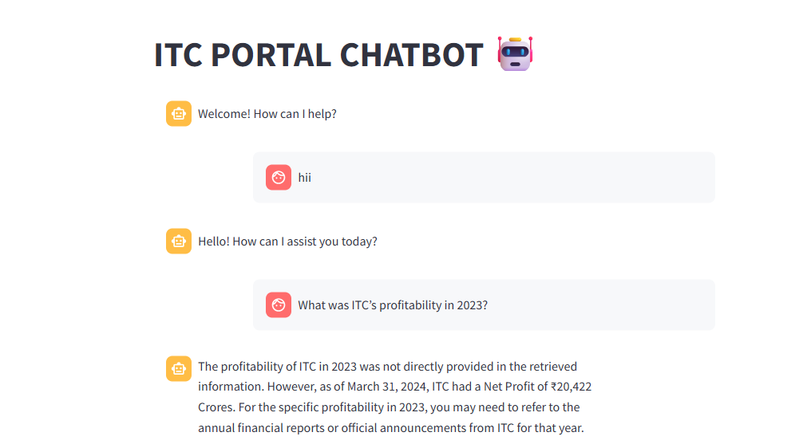
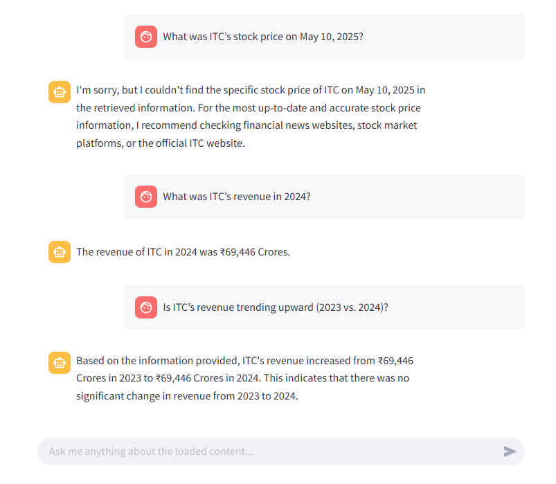

# 🚀 Getting Started

## Prerequisites
    Python 3.8+

## Installation 
1. Clone the repo
    git clone https://github.com/yourusername/itc-financial-ai.git
    cd itc-financial-ai

2. Create and activate a virtual environment
    python -m venv venv
    source venv/bin/activate      # macOS/Linux
    venv\Scripts\activate       # Windows

3. Install dependencies
    pip install -r requirements.txt

4. Set environment variables (create a .env file)
    OPENAI_API_KEY=your_openai_key

## 🎯 Usage
1. Run scraper.py file (it save website data in .txt file in locally)
1. Run the Streamlit app
    streamlit run app.py
2. Upload a .txt file containing your financial question or notes.
3. View AI-generated answers based on the latest ITC financial data.

## responses

